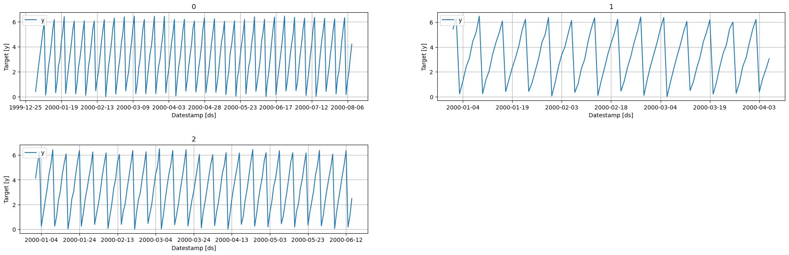

utilsforecast
================

<!-- WARNING: THIS FILE WAS AUTOGENERATED! DO NOT EDIT! -->

## Install

``` sh
pip install utilsforecast
```

## How to use

``` python
from utilsforecast.data import generate_series
from utilsforecast.plotting import plot
```

``` python
series = generate_series(3)
plot(series, plot_random=False, engine='matplotlib')
```


