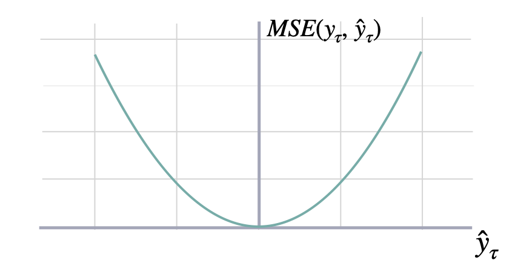
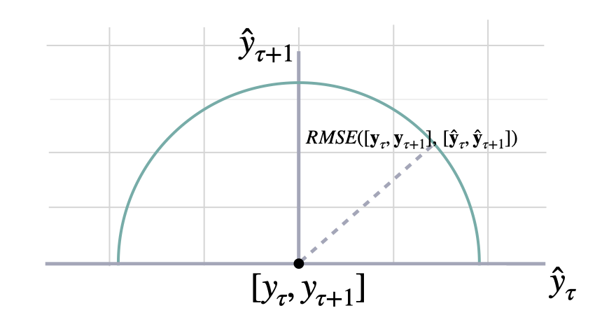
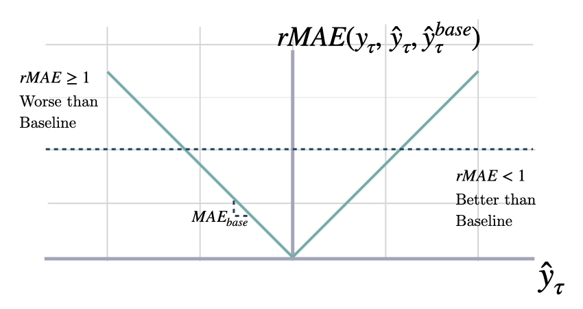

The most important train signal is the forecast error, which is the
difference between the observed value $y_{\tau}$ and the prediction
$\hat{y}_{\tau}$, at time $y_{\tau}$:

$$

e_{\tau} = y_{\tau}-\hat{y}_{\tau} \qquad \qquad \tau \in \{t+1,\dots,t+H \}

$$

The train loss summarizes the forecast errors in different evaluation
metrics.

## 1. Scale-dependent Errors

### Mean Absolute Error

$$

\mathrm{MAE}(\mathbf{y}_{\tau}, \mathbf{\hat{y}}_{\tau}) = \frac{1}{H} \sum^{t+H}_{\tau=t+1} |y_{\tau} - \hat{y}_{\tau}|

$$

::: utilsforecast.losses.mae
    handler: python
    options:
      docstring_style: google
      heading_level: 4
      show_root_heading: true
      show_source: true

### Mean Squared Error

$$

\mathrm{MSE}(\mathbf{y}_{\tau}, \mathbf{\hat{y}}_{\tau}) = \frac{1}{H} \sum^{t+H}_{\tau=t+1} (y_{\tau} - \hat{y}_{\tau})^{2}

$$

::: utilsforecast.losses.mse
    handler: python
    options:
      docstring_style: google
      heading_level: 4
      show_root_heading: true
      show_source: true

### Root Mean Squared Error

$$

\mathrm{RMSE}(\mathbf{y}_{\tau}, \mathbf{\hat{y}}_{\tau}) = \sqrt{\frac{1}{H} \sum^{t+H}_{\tau=t+1} (y_{\tau} - \hat{y}_{\tau})^{2}}

$$

::: utilsforecast.losses.rmse
    handler: python
    options:
      docstring_style: google
      heading_level: 4
      show_root_heading: true
      show_source: true

### Bias

$$

\mathrm{Bias}(\mathbf{y}_{\tau}, \mathbf{\hat{y}}_{\tau}) = \frac{1}{H} \sum^{t+H}_{\tau=t+1} (\hat{y}_{\tau} - \mathbf{y}_{\tau})

$$

::: utilsforecast.losses.bias
    handler: python
    options:
      docstring_style: google
      heading_level: 4
      show_root_heading: true
      show_source: true

### Cumulative Forecast Error

$$

\mathrm{CFE}(\mathbf{y}_{\tau}, \mathbf{\hat{y}}_{\tau}) = \sum^{t+H}_{\tau=t+1} (\hat{y}_{\tau} - \mathbf{y}_{\tau})

$$

::: utilsforecast.losses.cfe
    handler: python
    options:
      docstring_style: google
      heading_level: 4
      show_root_heading: true
      show_source: true

### Absolute Periods In Stock

$$

\mathrm{PIS}(\mathbf{y}_{\tau}, \mathbf{\hat{y}}_{\tau}) = \sum^{t+H}_{\tau=t+1} |y_{\tau} - \hat{y}_{\tau}|

$$

::: utilsforecast.losses.pis
    handler: python
    options:
      docstring_style: google
      heading_level: 4
      show_root_heading: true
      show_source: true

### Linex

$$
\mathrm{Linex}(\mathbf{y}_{\tau}, \mathbf{\hat{y}}_{\tau}) = \frac{1}{H} \sum^{t+H}_{\tau=t+1} (e^{a(y_{\tau} - \hat{y}_{\tau})} - a(y_{\tau} - \hat{y}_{\tau}) - 1)
$$

where must be $a\neq0$.

::: utilsforecast.losses.linex
    handler: python
    options:
      docstring_style: google
      heading_level: 4
      show_root_heading: true
      show_source: true

## 2. Percentage Errors

### Mean Absolute Percentage Error

$$

\mathrm{MAPE}(\mathbf{y}_{\tau}, \mathbf{\hat{y}}_{\tau}) = \frac{1}{H} \sum^{t+H}_{\tau=t+1} \frac{|y_{\tau}-\hat{y}_{\tau}|}{|y_{\tau}|}

$$

::: utilsforecast.losses.mape
    handler: python
    options:
      docstring_style: google
      heading_level: 4
      show_root_heading: true
      show_source: true

### Symmetric Mean Absolute Percentage Error

$$

\mathrm{SMAPE}_{2}(\mathbf{y}_{\tau}, \mathbf{\hat{y}}_{\tau}) = \frac{1}{H} \sum^{t+H}_{\tau=t+1} \frac{|y_{\tau}-\hat{y}_{\tau}|}{|y_{\tau}|+|\hat{y}_{\tau}|}

$$

::: utilsforecast.losses.smape
    handler: python
    options:
      docstring_style: google
      heading_level: 4
      show_root_heading: true
      show_source: true

## 3. Scale-independent Errors

### Mean Absolute Scaled Error

$$

\mathrm{MASE}(\mathbf{y}_{\tau}, \mathbf{\hat{y}}_{\tau}, \mathbf{\hat{y}}^{season}_{\tau}) = 
\frac{1}{H} \sum^{t+H}_{\tau=t+1} \frac{|y_{\tau}-\hat{y}_{\tau}|}{\mathrm{MAE}(\mathbf{y}_{\tau}, \mathbf{\hat{y}}^{season}_{\tau})}

$$

::: utilsforecast.losses.mase
    handler: python
    options:
      docstring_style: google
      heading_level: 4
      show_root_heading: true
      show_source: true

### Relative Mean Absolute Error

$$

\mathrm{RMAE}(\mathbf{y}_{\tau}, \mathbf{\hat{y}}_{\tau}, \mathbf{\hat{y}}^{base}_{\tau}) = \frac{1}{H} \sum^{t+H}_{\tau=t+1} \frac{|y_{\tau}-\hat{y}_{\tau}|}{\mathrm{MAE}(\mathbf{y}_{\tau}, \mathbf{\hat{y}}^{base}_{\tau})}

$$

::: utilsforecast.losses.rmae
    handler: python
    options:
      docstring_style: google
      heading_level: 4
      show_root_heading: true
      show_source: true

### Normalized Deviation

$$

\mathrm{ND}(\mathbf{y}_{\tau}, \mathbf{\hat{y}}_{\tau}) = \frac{\sum^{t+H}_{\tau=t+1} |y_{\tau} - \hat{y}_{\tau}|}{\sum^{t+H}_{\tau=t+1} | y_{\tau} |}

$$

::: utilsforecast.losses.nd
    handler: python
    options:
      docstring_style: google
      heading_level: 4
      show_root_heading: true
      show_source: true

### Mean Squared Scaled Error

$$

\mathrm{MSSE}(\mathbf{y}_{\tau}, \mathbf{\hat{y}}_{\tau}, \mathbf{\hat{y}}^{season}_{\tau}) = 
\frac{1}{H} \sum^{t+H}_{\tau=t+1} \frac{(y_{\tau}-\hat{y}_{\tau})^2}{\mathrm{MSE}(\mathbf{y}_{\tau}, \mathbf{\hat{y}}^{season}_{\tau})}

$$

::: utilsforecast.losses.msse
    handler: python
    options:
      docstring_style: google
      heading_level: 3
      show_root_heading: true
      show_source: true

### Root Mean Squared Scaled Error

$$

\mathrm{RMSSE}(\mathbf{y}_{\tau}, \mathbf{\hat{y}}_{\tau}, \mathbf{\hat{y}}^{season}_{\tau}) = 
\sqrt{\frac{1}{H} \sum^{t+H}_{\tau=t+1} \frac{(y_{\tau}-\hat{y}_{\tau})^2}{\mathrm{MSE}(\mathbf{y}_{\tau}, \mathbf{\hat{y}}^{season}_{\tau})}}

$$

::: utilsforecast.losses.rmsse
    handler: python
    options:
      docstring_style: google
      heading_level: 3
      show_root_heading: true
      show_source: true

### Scaled Absolute Periods In Stock

$$

\mathrm{PIS}(\mathbf{y}_{\tau}, \mathbf{\hat{y}}_{\tau}) = \sum^{t+H}_{\tau=t+1} \frac{|y_{\tau} - \hat{y}_{\tau}|}{\bar{y}}

$$

::: utilsforecast.losses.spis
    handler: python
    options:
      docstring_style: google
      heading_level: 4
      show_root_heading: true
      show_source: true

## 4. Probabilistic Errors

### Quantile Loss

$$

\mathrm{QL}(\mathbf{y}_{\tau}, \mathbf{\hat{y}}^{(q)}_{\tau}) = 
\frac{1}{H} \sum^{t+H}_{\tau=t+1} 
\Big( (1-q)\,( \hat{y}^{(q)}_{\tau} - y_{\tau} )_{+} 
+ q\,( y_{\tau} - \hat{y}^{(q)}_{\tau} )_{+} \Big)

$$

::: utilsforecast.losses.quantile_loss
    handler: python
    options:
      docstring_style: google
      heading_level: 4
      show_root_heading: true
      show_source: true

### Scaled Quantile Loss

$$

\mathrm{SQL}(\mathbf{y}_{\tau}, \mathbf{\hat{y}}^{(q)}_{\tau}) = 
\frac{1}{H} \sum^{t+H}_{\tau=t+1} 
\frac{(1-q)\,( \hat{y}^{(q)}_{\tau} - y_{\tau} )_{+} 
+ q\,( y_{\tau} - \hat{y}^{(q)}_{\tau} )_{+}}{\mathrm{MAE}(\mathbf{y}_{\tau}, \mathbf{\hat{y}}^{season}_{\tau})}

$$

::: utilsforecast.losses.scaled_quantile_loss
    handler: python
    options:
      docstring_style: google
      heading_level: 4
      show_root_heading: tr
      
### Multi-Quantile Loss

$$

\mathrm{MQL}(\mathbf{y}_{\tau},
[\mathbf{\hat{y}}^{(q_{1})}_{\tau}, ... ,\hat{y}^{(q_{n})}_{\tau}]) = 
\frac{1}{n} \sum_{q_{i}} \mathrm{QL}(\mathbf{y}_{\tau}, \mathbf{\hat{y}}^{(q_{i})}_{\tau})

$$

::: utilsforecast.losses.mqloss
    handler: python
    options:
      docstring_style: google
      heading_level: 4
      show_root_heading: true
      show_source: true

### Scaled Multi-Quantile Loss

$$

\mathrm{MQL}(\mathbf{y}_{\tau},
[\mathbf{\hat{y}}^{(q_{1})}_{\tau}, ... ,\hat{y}^{(q_{n})}_{\tau}]) = 
\frac{1}{n} \sum_{q_{i}} \frac{\mathrm{QL}(\mathbf{y}_{\tau}, \mathbf{\hat{y}}^{(q_{i})}_{\tau})}{\mathrm{MAE}(\mathbf{y}_{\tau}, \mathbf{\hat{y}}^{season}_{\tau})}

$$

::: utilsforecast.losses.scaled_mqloss
    handler: python
    options:
      docstring_style: google
      heading_level: 4
      show_root_heading: true
      show_source: true

### Coverage

::: utilsforecast.losses.coverage
    handler: python
    options:
      docstring_style: google
      heading_level: 4
      show_root_heading: true
      show_source: true

### Calibration

::: utilsforecast.losses.calibration
    handler: python
    options:
      docstring_style: google
      heading_level: 4
      show_root_heading: true
      show_source: true

### CRPS

$$

\mathrm{sCRPS}(\hat{F}_{\tau}, \mathbf{y}_{\tau}) = \frac{2}{N} \sum_{i}
\int^{1}_{0} \frac{\mathrm{QL}(\hat{F}_{i,\tau}, y_{i,\tau})_{q}}{\sum_{i} | y_{i,\tau} |} dq

$$

Where $\hat{F}_{\tau}$ is the an estimated multivariate distribution,
and $y_{i,\tau}$ are its realizations.

::: utilsforecast.losses.scaled_crps
    handler: python
    options:
      docstring_style: google
      heading_level: 4
      show_root_heading: true
      show_source: true

### Tweedie Deviance

For a set of forecasts $\{\mu_i\}_{i=1}^N$ and observations
$\{y_i\}_{i=1}^N$, the mean Tweedie deviance with power $p$ is

$$

\mathrm{TD}_{p}(\boldsymbol{\mu}, \mathbf{y})
= \frac{1}{N} \sum_{i=1}^{N} d_{p}(y_i, \mu_i)

$$

where the unit-scaled deviance for each pair $(y,\mu)$ is

$$

d_{p}(y,\mu)
=
2
\begin{cases}
\displaystyle
\frac{y^{2-p}}{(1-p)(2-p)}
\;-\;
\frac{y\,\mu^{1-p}}{1-p}
\;+\;
\frac{\mu^{2-p}}{2-p}, 
& p \notin\{1,2\},\\[1em]
\displaystyle
y\,\ln\!\frac{y}{\mu}\;-\;(y-\mu),
& p = 1\quad(\text{Poisson deviance}),\\[0.5em]
\displaystyle
-2\Bigl[\ln\!\frac{y}{\mu}\;-\;\frac{y-\mu}{\mu}\Bigr],
& p = 2\quad(\text{Gamma deviance}).
\end{cases}

$$

- $y_i$ are the true values, $\mu_i$ the predicted means.  
- $p$ controls the variance relationship
  $\mathrm{Var}(Y)\propto\mu^{p}$.  
- When $1<p<2$, this smoothly interpolates between Poisson ($p=1$) and
  Gamma ($p=2$) deviance.

::: utilsforecast.losses.tweedie_deviance
    handler: python
    options:
      docstring_style: google
      heading_level: 4
      show_root_heading: true
      show_source: true