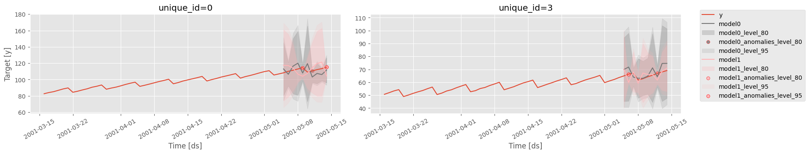

::: utilsforecast.plotting.plot_series
    handler: python
    options:
      docstring_style: google
      heading_level: 3
      show_root_heading: true
      show_source: true


```python
from utilsforecast.data import generate_series
```


```python
level = [80, 95]
series = generate_series(4, freq='D', equal_ends=True, with_trend=True, n_models=2, level=level)
test_pd = series.groupby('unique_id', observed=True).tail(10).copy()
train_pd = series.drop(test_pd.index)
```


```python
plt.style.use('ggplot')
fig = plot_series(
    train_pd,
    forecasts_df=test_pd,
    ids=[0, 3],
    plot_random=False,
    level=level,    
    max_insample_length=50,
    engine='matplotlib',
    plot_anomalies=True,
)
fig.savefig('imgs/plotting.png', bbox_inches='tight')
```


