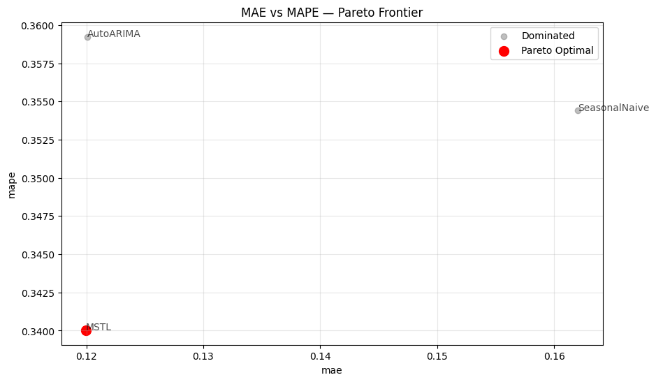
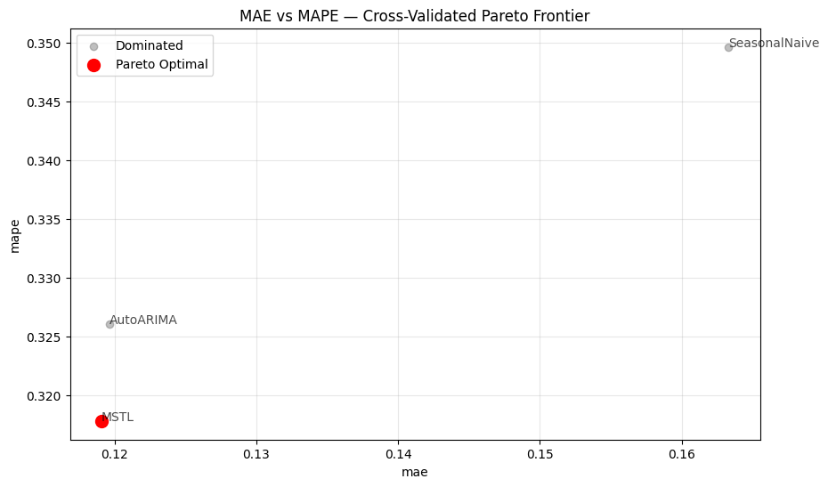

> Learn how to select the best forecasting models when you care about
> more than one metric — without manually ranking and comparing every
> combination.

## What you’ll learn

-   Why single-metric model selection can be misleading
-   What Pareto dominance means and when a model is “dominated”
-   How to use `evaluate()` correctly as input to `ParetoFrontier`
-   How to visualize the 2D Pareto frontier across any two metrics
-   How to handle cross-validation output for multi-objective selection

## The problem: picking one winner across multiple metrics

After training several forecasting models, a common question is: **which
one should I deploy?**

If you optimize for a single metric — say MAE — the answer is
straightforward: pick the lowest MAE. But real-world requirements rarely
reduce to a single number. You might care about:

-   **Accuracy** (MAE, RMSE): how close are point forecasts to actuals?
-   **Relative error** (MAPE, sMAPE): how large is the error relative to
    the scale of the series?
-   **Bias** (bias, CFE): does the model systematically over- or
    under-forecast?

When metrics disagree — Model A has the best MAE, Model B has the best
MAPE — a simple ranking breaks down.

**Pareto analysis** offers a principled solution: instead of collapsing
everything to a single score, identify which models are not *dominated*.
A model is dominated when another model is at least as good on every
metric and strictly better on at least one. Non-dominated models form
the **Pareto frontier** — the set of trade-off-optimal choices.

## Install libraries

```python
%%capture
pip install utilsforecast statsforecast -U
```


```python
import warnings
warnings.filterwarnings('ignore')

import pandas as pd
from statsforecast import StatsForecast
from statsforecast.models import AutoARIMA, MSTL, SeasonalNaive

from utilsforecast.data import generate_series
from utilsforecast.losses import mae, mape, rmse, smape
from utilsforecast.evaluation import evaluate
from utilsforecast.model_selection import ParetoFrontier
```

## Generate synthetic time series

We use `generate_series` to create a panel of daily time series with
weekly seasonality. Each series contains between 100 and 150
observations, giving models enough history for a meaningful fit.

```python
series = generate_series(
    n_series=8,
    freq='D',
    min_length=100,
    max_length=150,
    seed=42,
)
# StatsForecast requires string or integer unique_id, not Categorical
series['unique_id'] = series['unique_id'].astype(str)
series.head()
```

|     | unique_id | ds         | y        |
|-----|-----------|------------|----------|
| 0   | 0         | 2000-01-01 | 0.049987 |
| 1   | 0         | 2000-01-02 | 1.229624 |
| 2   | 0         | 2000-01-03 | 2.166854 |
| 3   | 0         | 2000-01-04 | 3.071433 |
| 4   | 0         | 2000-01-05 | 4.325444 |

We hold out the last 14 days of each series as the evaluation window and
use the rest for training.

```python
HORIZON = 14
SEASON  = 7

test_mask = series.groupby('unique_id').cumcount(ascending=False) < HORIZON
train = series[~test_mask].reset_index(drop=True)
test  = series[test_mask].reset_index(drop=True)

print(f'Train: {len(train)} rows | Test: {len(test)} rows')
```

``` text
Train: 893 rows | Test: 112 rows
```

## Fit models and generate forecasts

We compare three models that cover a range of complexity:

-   **SeasonalNaive** — repeats the last observed season. Fast,
    transparent, surprisingly hard to beat.
-   **AutoARIMA** — fits a SARIMA model selected automatically by AIC.
    More flexible but slower.
-   **MSTL** — decomposes the series into trend and seasonal components
    using STL, then forecasts each part separately. Good at capturing
    multiple seasonal patterns.

```python
sf = StatsForecast(
    models=[
        SeasonalNaive(season_length=SEASON),
        AutoARIMA(season_length=SEASON),
        MSTL(season_length=SEASON),
    ],
    freq='D',
    n_jobs=1,
)
sf.fit(train)
preds = sf.predict(h=HORIZON)
preds.head()
```

|     | unique_id | ds         | SeasonalNaive | AutoARIMA | MSTL     |
|-----|-----------|------------|---------------|-----------|----------|
| 0   | 0         | 2000-05-04 | 5.453414      | 5.296218  | 5.283464 |
| 1   | 0         | 2000-05-05 | 6.136066      | 6.198051  | 6.193499 |
| 2   | 0         | 2000-05-06 | 0.323845      | 0.277377  | 0.280454 |
| 3   | 0         | 2000-05-07 | 1.000260      | 1.234950  | 1.244538 |
| 4   | 0         | 2000-05-08 | 2.176284      | 2.252924  | 2.278188 |

Merge predictions with the held-out actuals to get a single DataFrame
ready for `evaluate()`.

```python
eval_df = test.merge(preds, on=['unique_id', 'ds'], how='left')
eval_df.head()
```

|     | unique_id | ds         | y        | SeasonalNaive | AutoARIMA | MSTL     |
|-----|-----------|------------|----------|---------------|-----------|----------|
| 0   | 0         | 2000-05-04 | 5.267045 | 5.453414      | 5.296218  | 5.283464 |
| 1   | 0         | 2000-05-05 | 6.242415 | 6.136066      | 6.198051  | 6.193499 |
| 2   | 0         | 2000-05-06 | 0.346218 | 0.323845      | 0.277377  | 0.280454 |
| 3   | 0         | 2000-05-07 | 1.134706 | 1.000260      | 1.234950  | 1.244538 |
| 4   | 0         | 2000-05-08 | 2.122063 | 2.176284      | 2.252924  | 2.278188 |

## Evaluate models across multiple metrics

`evaluate()` computes any combination of loss functions from
`utilsforecast.losses` and returns a tidy DataFrame with one row per
`(unique_id, metric)` and one column per model.

For Pareto analysis we need **one scalar per metric per model** — a
single number that summarises performance across all series. The
`agg_fn='mean'` argument collapses the per-series rows into a single
mean, giving a `(n_metrics, n_models)` table.

```python
scores = evaluate(
    df=eval_df,
    metrics=[mae, rmse, mape, smape],
    agg_fn='mean',
)
scores
```

|     | metric | SeasonalNaive | AutoARIMA | MSTL     |
|-----|--------|---------------|-----------|----------|
| 0   | mae    | 0.162020      | 0.120070  | 0.119955 |
| 1   | rmse   | 0.196461      | 0.145129  | 0.144143 |
| 2   | mape   | 0.354416      | 0.359234  | 0.340032 |
| 3   | smape  | 0.087060      | 0.065840  | 0.064982 |

At a glance, no single model wins on every metric. MSTL tends to have
lower absolute errors while SeasonalNaive can be competitive on relative
metrics for series with strong weekly patterns. This is exactly the
situation where Pareto analysis adds value.

## Find the Pareto frontier

`ParetoFrontier.find_non_dominated()` takes the aggregated scores table
and returns only the columns corresponding to non-dominated models —
dropping any model for which another model is at least as good on every
metric and strictly better on at least one.

```python
pareto = ParetoFrontier.find_non_dominated(scores)
pareto
```

|     | metric | MSTL     |
|-----|--------|----------|
| 0   | mae    | 0.119955 |
| 1   | rmse   | 0.144143 |
| 2   | mape   | 0.340032 |
| 3   | smape  | 0.064982 |

The models that survive are the **Pareto-optimal** set. Dropping the
rest is safe: for every eliminated model, there is at least one
surviving model that dominates it across every metric simultaneously.

### Focusing on a subset of metrics

You can restrict the comparison to only the metrics that matter for your
use case by passing a `metrics` list.

```python
# Only consider MAE and RMSE for dominance — ignore MAPE and sMAPE
pareto_subset = ParetoFrontier.find_non_dominated(scores, metrics=['mae', 'rmse'])
pareto_subset
```

|     | metric | MSTL     |
|-----|--------|----------|
| 0   | mae    | 0.119955 |
| 1   | rmse   | 0.144143 |

### Maximization metrics

By default all metrics are minimized (lower is better). If a metric
should be maximized — for example, a custom R² score — pass its name in
`maximization`.

```python
# Hypothetical: minimize MAE but maximize some score column
# ParetoFrontier.find_non_dominated(scores, maximization=['score'])

# With the current metrics, this is equivalent to the default:
pareto_min = ParetoFrontier.find_non_dominated(scores, metrics=['mae', 'rmse', 'mape', 'smape'])
pareto_min
```

|     | metric | MSTL     |
|-----|--------|----------|
| 0   | mae    | 0.119955 |
| 1   | rmse   | 0.144143 |
| 2   | mape   | 0.340032 |
| 3   | smape  | 0.064982 |

## Visualize the 2D Pareto frontier

When comparing two metrics, `ParetoFrontier.plot_pareto_2d()` renders a
scatter plot where dominated models appear in grey and Pareto-optimal
models appear in red, connected by a dashed frontier line.

```python
ParetoFrontier.plot_pareto_2d(
    scores,
    metric_x='mae',
    metric_y='mape',
    title='MAE vs MAPE — Pareto Frontier',
)
```



The plot accepts `maximize_x` and `maximize_y` flags for metrics where
larger is better, and `show_dominated=False` to declutter the chart when
many models are present.

## Cross-validation: multi-window model selection

A single held-out window can be noisy. StatsForecast’s
`cross_validation()` produces estimates across multiple windows, giving
a more robust picture of model performance.

The cross-validation output has a `cutoff` column — `evaluate()` keeps
it, so `agg_fn='mean'` aggregates across series *within each cutoff*,
not across all windows at once. To collapse everything into a single row
per metric for Pareto analysis, apply a second groupby.

```python
cv = sf.cross_validation(df=series, h=HORIZON, n_windows=3)
cv['unique_id'] = cv['unique_id'].astype(str)
cv.head()
```

|     | unique_id | ds         | cutoff     | y        | SeasonalNaive | AutoARIMA | MSTL     |
|-----|-----------|------------|------------|----------|---------------|-----------|----------|
| 0   | 0         | 2000-05-02 | 2000-05-01 | 3.152391 | 3.061044      | 3.200568  | 3.200882 |
| 1   | 0         | 2000-05-03 | 2000-05-01 | 4.082328 | 4.178149      | 4.194904  | 4.197371 |
| 2   | 0         | 2000-05-04 | 2000-05-01 | 5.267045 | 5.453414      | 5.294926  | 5.284707 |
| 3   | 0         | 2000-05-05 | 2000-05-01 | 6.242415 | 6.136066      | 6.198686  | 6.194711 |
| 4   | 0         | 2000-05-06 | 2000-05-01 | 0.346218 | 0.323845      | 0.277010  | 0.282018 |

```python
MODELS = [c for c in cv.columns if c not in {'unique_id', 'ds', 'cutoff', 'y'}]

# Step 1: compute per-(series, cutoff) scores
cv_scores = evaluate(
    df=cv,
    metrics=[mae, rmse, mape, smape],
)

# Step 2: average across both series and cutoffs
cv_scores_agg = cv_scores.groupby('metric', sort=False)[MODELS].mean().reset_index()
cv_scores_agg
```

|     | metric | SeasonalNaive | AutoARIMA | MSTL     |
|-----|--------|---------------|-----------|----------|
| 0   | mae    | 0.163304      | 0.119660  | 0.119076 |
| 1   | rmse   | 0.196949      | 0.144753  | 0.143648 |
| 2   | mape   | 0.349638      | 0.326070  | 0.317805 |
| 3   | smape  | 0.086262      | 0.064798  | 0.063181 |

```python
pareto_cv = ParetoFrontier.find_non_dominated(cv_scores_agg)
pareto_cv
```

|     | metric | MSTL     |
|-----|--------|----------|
| 0   | mae    | 0.119076 |
| 1   | rmse   | 0.143648 |
| 2   | mape   | 0.317805 |
| 3   | smape  | 0.063181 |

```python
ParetoFrontier.plot_pareto_2d(
    cv_scores_agg,
    metric_x='mae',
    metric_y='mape',
    title='MAE vs MAPE — Cross-Validated Pareto Frontier',
)
```



## Custom column names

If your pipeline uses column names different from the defaults
(`unique_id`, `cutoff`), pass `id_col` and `cutoff_col` to both
`evaluate()` and `find_non_dominated()` so the Pareto analysis correctly
identifies which columns are model predictions.

```python
# Rename to simulate a custom pipeline
eval_df_custom = eval_df.rename(columns={'unique_id': 'series_id'})

scores_custom = evaluate(
    df=eval_df_custom,
    metrics=[mae, rmse],
    id_col='series_id',
    agg_fn='mean',
)

# Pass the same id_col so find_non_dominated() excludes it from model columns
ParetoFrontier.find_non_dominated(scores_custom, id_col='series_id')
```

|     | metric | MSTL     |
|-----|--------|----------|
| 0   | mae    | 0.119955 |
| 1   | rmse   | 0.144143 |

## Key takeaways

-   **Single-metric selection discards information.** When metrics
    disagree, there is no universally correct answer — only trade-offs
    worth making explicit.
-   **Pareto dominance is a lossless filter.** Every eliminated model is
    objectively outperformed; no information about the surviving
    frontier is lost.
-   **Always aggregate before calling `find_non_dominated()`.** Pass
    `agg_fn='mean'` to `evaluate()` so the input has exactly one row per
    metric. For cross-validation output, apply a second groupby over the
    `metric` column to collapse across cutoffs as well.
-   **`plot_pareto_2d()` makes the trade-off tangible.** Pick any two
    metrics on the axes to see which models sit on the frontier and
    which ones are dominated.
-   **Custom column names are supported.** Pass `id_col` and
    `cutoff_col` consistently across `evaluate()` and
    `find_non_dominated()` when your data uses non-default names.

