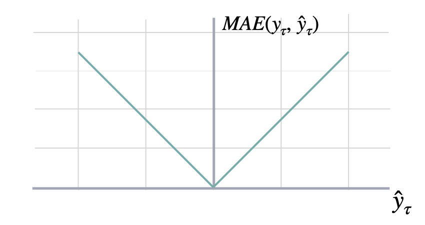
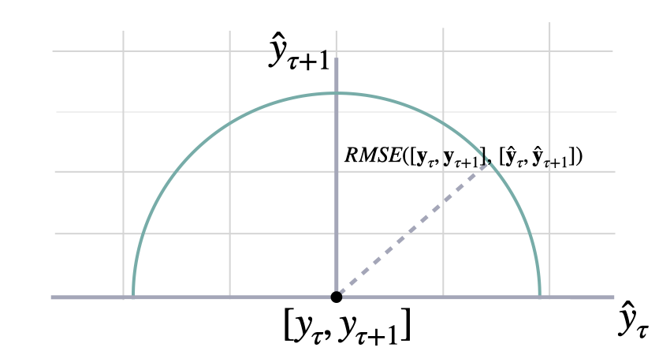
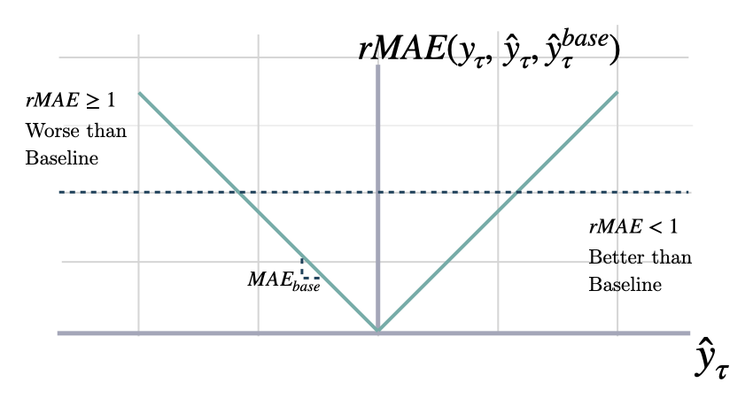
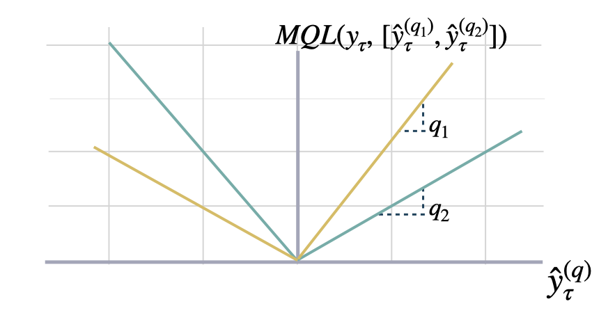

The most important train signal is the forecast error, which is the
difference between the observed value $y_{\tau}$ and the prediction
$\hat{y}_{\tau}$, at time $y_{\tau}$:

$$

e_{\tau} = y_{\tau}-\hat{y}_{\tau} \qquad \qquad \tau \in \{t+1,\dots,t+H \}

$$

The train loss summarizes the forecast errors in different evaluation
metrics.


## 1. Scale-dependent Errors

### Mean Absolute Error

$$

\mathrm{MAE}(\mathbf{y}_{\tau}, \mathbf{\hat{y}}_{\tau}) = \frac{1}{H} \sum^{t+H}_{\tau=t+1} |y_{\tau} - \hat{y}_{\tau}|

$$


#### `mae`

```python
mae(df, models, id_col='unique_id', target_col='y')
```

Mean Absolute Error (MAE)

MAE measures the relative prediction
accuracy of a forecasting method by calculating the
deviation of the prediction and the true
value at a given time and averages these devations
over the length of the series.

### Mean Squared Error

$$

\mathrm{MSE}(\mathbf{y}_{\tau}, \mathbf{\hat{y}}_{\tau}) = \frac{1}{H} \sum^{t+H}_{\tau=t+1} (y_{\tau} - \hat{y}_{\tau})^{2}

$$


#### `mse`

```python
mse(df, models, id_col='unique_id', target_col='y')
```

Mean Squared Error (MSE)

MSE measures the relative prediction
accuracy of a forecasting method by calculating the
squared deviation of the prediction and the true
value at a given time, and averages these devations
over the length of the series.

### Root Mean Squared Error

$$

\mathrm{RMSE}(\mathbf{y}_{\tau}, \mathbf{\hat{y}}_{\tau}) = \sqrt{\frac{1}{H} \sum^{t+H}_{\tau=t+1} (y_{\tau} - \hat{y}_{\tau})^{2}}

$$


#### `rmse`

```python
rmse(df, models, id_col='unique_id', target_col='y')
```

Root Mean Squared Error (RMSE)

RMSE measures the relative prediction
accuracy of a forecasting method by calculating the squared deviation
of the prediction and the observed value at a given time and
averages these devations over the length of the series.
Finally the RMSE will be in the same scale
as the original time series so its comparison with other
series is possible only if they share a common scale.
RMSE has a direct connection to the L2 norm.

### Bias

$$

\mathrm{Bias}(\mathbf{y}_{\tau}, \mathbf{\hat{y}}_{\tau}) = \frac{1}{H} \sum^{t+H}_{\tau=t+1} (\hat{y}_{\tau} - \mathbf{y}_{\tau})

$$

#### `bias`

```python
bias(df, models, id_col='unique_id', target_col='y')
```

Forecast estimator bias.

Defined as prediction - actual

### Cumulative Forecast Error

$$

\mathrm{CFE}(\mathbf{y}_{\tau}, \mathbf{\hat{y}}_{\tau}) = \sum^{t+H}_{\tau=t+1} (\hat{y}_{\tau} - \mathbf{y}_{\tau})

$$

#### `cfe`

```python
cfe(df, models, id_col='unique_id', target_col='y')
```

Cumulative Forecast Error (CFE)

Total signed forecast error per series. Positive values mean under forecast; negative mean over forecast.

### Absolute Periods In Stock

$$

\mathrm{PIS}(\mathbf{y}_{\tau}, \mathbf{\hat{y}}_{\tau}) = \sum^{t+H}_{\tau=t+1} |y_{\tau} - \hat{y}_{\tau}|

$$

#### `pis`

```python
pis(df, models, id_col='unique_id', target_col='y')
```

Compute the raw Absolute Periods In Stock (PIS) for one or multiple models.

The PIS metric sums the absolute forecast errors per series without any scaling,
yielding a scale-dependent measure of bias.

### Linex

$$
\mathrm{Linex}(\mathbf{y}_{\tau}, \mathbf{\hat{y}}_{\tau}) = \frac{1}{H} \sum^{t+H}_{\tau=t+1} (e^{a(y_{\tau} - \hat{y}_{\tau})} - a(y_{\tau} - \hat{y}_{\tau}) - 1)
$$

where must be $a\neq0$.

#### `linex`

```python
linex(df, models, id_col='unique_id', target_col='y', a=1.0)
```

Linex Loss (Linear Exponential)

The Linex loss penalizes over- and under-forecasting
asymmetrically depending on the parameter a.

- If a > 0, under-forecasting (y > y_hat) is penalized more.
- If a < 0, over-forecasting (y_hat > y) is penalized more.
- a must not be 0.

Formula: exp(a·error) - a·error - 1, where error = prediction - actual.

**Parameters:**

Name | Type | Description | Default
---- | ---- | ----------- | -------
`a` | <code>[float](#float)</code> | Asymmetry parameter. Must be non-zero. Defaults to 1.0. | <code>1.0</code>

## 2. Percentage Errors

### Mean Absolute Percentage Error

$$

\mathrm{MAPE}(\mathbf{y}_{\tau}, \mathbf{\hat{y}}_{\tau}) = \frac{1}{H} \sum^{t+H}_{\tau=t+1} \frac{|y_{\tau}-\hat{y}_{\tau}|}{|y_{\tau}|}

$$


#### `mape`

```python
mape(df, models, id_col='unique_id', target_col='y')
```

Mean Absolute Percentage Error (MAPE)

MAPE measures the relative prediction
accuracy of a forecasting method by calculating the percentual deviation
of the prediction and the observed value at a given time and
averages these devations over the length of the series.
The closer to zero an observed value is, the higher penalty MAPE loss
assigns to the corresponding error.

### Symmetric Mean Absolute Percentage Error

$$

\mathrm{SMAPE}_{2}(\mathbf{y}_{\tau}, \mathbf{\hat{y}}_{\tau}) = \frac{1}{H} \sum^{t+H}_{\tau=t+1} \frac{|y_{\tau}-\hat{y}_{\tau}|}{|y_{\tau}|+|\hat{y}_{\tau}|}

$$

#### `smape`

```python
smape(df, models, id_col='unique_id', target_col='y')
```

Symmetric Mean Absolute Percentage Error (SMAPE)

SMAPE measures the relative prediction
accuracy of a forecasting method by calculating the relative deviation
of the prediction and the observed value scaled by the sum of the
absolute values for the prediction and observed value at a
given time, then averages these devations over the length
of the series. This allows the SMAPE to have bounds between
0% and 100% which is desirable compared to normal MAPE that
may be undetermined when the target is zero.

## 3. Scale-independent Errors

### Mean Absolute Scaled Error

$$

\mathrm{MASE}(\mathbf{y}_{\tau}, \mathbf{\hat{y}}_{\tau}, \mathbf{\hat{y}}^{season}_{\tau}) = 
\frac{1}{H} \sum^{t+H}_{\tau=t+1} \frac{|y_{\tau}-\hat{y}_{\tau}|}{\mathrm{MAE}(\mathbf{y}_{\tau}, \mathbf{\hat{y}}^{season}_{\tau})}

$$


#### `mase`

```python
mase(df, models, seasonality, train_df, id_col='unique_id', target_col='y')
```

Mean Absolute Scaled Error (MASE)

MASE measures the relative prediction
accuracy of a forecasting method by comparinng the mean absolute errors
of the prediction and the observed value against the mean
absolute errors of the seasonal naive model.
The MASE partially composed the Overall Weighted Average (OWA),
used in the M4 Competition.

**Parameters:**

Name | Type | Description | Default
---- | ---- | ----------- | -------
`df` | <code>pandas or polars DataFrame</code> | Input dataframe with id, actuals and predictions. | *required*
`models` | <code>list of str</code> | Columns that identify the models predictions. | *required*
`seasonality` | <code>[int](#int)</code> | Main frequency of the time series; Hourly 24, Daily 7, Weekly 52, Monthly 12, Quarterly 4, Yearly 1. | *required*
`train_df` | <code>pandas or polars DataFrame</code> | Training dataframe with id and actual values. Must be sorted by time. | *required*
`id_col` | <code>[str](#str)</code> | Column that identifies each serie. Defaults to 'unique_id'. | <code>'unique_id'</code>
`target_col` | <code>[str](#str)</code> | Column that contains the target. Defaults to 'y'. | <code>'y'</code>

**Returns:**

Type | Description
---- | -----------
<code>[IntoDataFrameT](#narwhals.stable.v2.typing.IntoDataFrameT)</code> | pandas or polars DataFrame: dataframe with one row per id and one column per model.

<details class="references" open markdown="1">
<summary>References</summary>

[1] https://robjhyndman.com/papers/mase.pdf

</details>

### Relative Mean Absolute Error

$$

\mathrm{RMAE}(\mathbf{y}_{\tau}, \mathbf{\hat{y}}_{\tau}, \mathbf{\hat{y}}^{base}_{\tau}) = \frac{1}{H} \sum^{t+H}_{\tau=t+1} \frac{|y_{\tau}-\hat{y}_{\tau}|}{\mathrm{MAE}(\mathbf{y}_{\tau}, \mathbf{\hat{y}}^{base}_{\tau})}

$$



#### `rmae`

```python
rmae(df, models, baseline, id_col='unique_id', target_col='y')
```

Relative Mean Absolute Error (RMAE)

Calculates the RAME between two sets of forecasts (from two different forecasting methods).
A number smaller than one implies that the forecast in the
numerator is better than the forecast in the denominator.

**Parameters:**

Name | Type | Description | Default
---- | ---- | ----------- | -------
`df` | <code>pandas or polars DataFrame</code> | Input dataframe with id, times, actuals and predictions. | *required*
`models` | <code>list of str</code> | Columns that identify the models predictions. | *required*
`baseline` | <code>[str](#str)</code> | Column that identifies the baseline model predictions. | *required*
`id_col` | <code>[str](#str)</code> | Column that identifies each serie. Defaults to 'unique_id'. | <code>'unique_id'</code>
`target_col` | <code>[str](#str)</code> | Column that contains the target. Defaults to 'y'. | <code>'y'</code>

**Returns:**

Type | Description
---- | -----------
<code>[IntoDataFrameT](#narwhals.stable.v2.typing.IntoDataFrameT)</code> | pandas or polars DataFrame: dataframe with one row per id and one column per model.

### Normalized Deviation

$$

\mathrm{ND}(\mathbf{y}_{\tau}, \mathbf{\hat{y}}_{\tau}) = \frac{\sum^{t+H}_{\tau=t+1} |y_{\tau} - \hat{y}_{\tau}|}{\sum^{t+H}_{\tau=t+1} | y_{\tau} |}

$$

#### `nd`

```python
nd(df, models, id_col='unique_id', target_col='y')
```

Normalized Deviation (ND)

ND measures the relative prediction
accuracy of a forecasting method by calculating the
sum of the absolute deviation of the prediction and the true
value at a given time and dividing it by the sum of the absolute
value of the ground truth.

**Parameters:**

Name | Type | Description | Default
---- | ---- | ----------- | -------
`df` | <code>[IntoDataFrameT](#narwhals.stable.v2.typing.IntoDataFrameT)</code> | Input dataframe with id, times, actuals and predictions. | *required*
`models` | <code>[List](#typing.List)\[[str](#str)\]</code> | Columns that identify the models predictions. | *required*
`id_col` | <code>[str](#str)</code> | Column that identifies each serie. Defaults to 'unique_id'. | <code>'unique_id'</code>
`target_col` | <code>[str](#str)</code> | Column that contains the target. Defaults to 'y'. | <code>'y'</code>

**Returns:**

Type | Description
---- | -----------
<code>[IntoDataFrameT](#narwhals.stable.v2.typing.IntoDataFrameT)</code> | Dataframe with one row per id and one column per model.

### Mean Squared Scaled Error

$$

\mathrm{MSSE}(\mathbf{y}_{\tau}, \mathbf{\hat{y}}_{\tau}, \mathbf{\hat{y}}^{season}_{\tau}) = 
\frac{1}{H} \sum^{t+H}_{\tau=t+1} \frac{(y_{\tau}-\hat{y}_{\tau})^2}{\mathrm{MSE}(\mathbf{y}_{\tau}, \mathbf{\hat{y}}^{season}_{\tau})}

$$

### `msse`

```python
msse(df, models, seasonality, train_df, id_col='unique_id', target_col='y')
```

Mean Squared Scaled Error (MSSE)

MSSE measures the relative prediction
accuracy of a forecasting method by comparinng the mean squared errors
of the prediction and the observed value against the mean
squared errors of the seasonal naive model.

**Parameters:**

Name | Type | Description | Default
---- | ---- | ----------- | -------
`df` | <code>pandas or polars DataFrame</code> | Input dataframe with id, actuals and predictions. | *required*
`models` | <code>list of str</code> | Columns that identify the models predictions. | *required*
`seasonality` | <code>[int](#int)</code> | Main frequency of the time series; Hourly 24, Daily 7, Weekly 52, Monthly 12, Quarterly 4, Yearly 1. | *required*
`train_df` | <code>pandas or polars DataFrame</code> | Training dataframe with id and actual values. Must be sorted by time. | *required*
`id_col` | <code>[str](#str)</code> | Column that identifies each serie. Defaults to 'unique_id'. | <code>'unique_id'</code>
`target_col` | <code>[str](#str)</code> | Column that contains the target. Defaults to 'y'. | <code>'y'</code>

**Returns:**

Type | Description
---- | -----------
<code>[IntoDataFrameT](#narwhals.stable.v2.typing.IntoDataFrameT)</code> | pandas or polars DataFrame: dataframe with one row per id and one column per model.

<details class="references" open markdown="1">
<summary>References</summary>

[1] https://otexts.com/fpp3/accuracy.html

</details>

### Root Mean Squared Scaled Error

$$

\mathrm{RMSSE}(\mathbf{y}_{\tau}, \mathbf{\hat{y}}_{\tau}, \mathbf{\hat{y}}^{season}_{\tau}) = 
\sqrt{\frac{1}{H} \sum^{t+H}_{\tau=t+1} \frac{(y_{\tau}-\hat{y}_{\tau})^2}{\mathrm{MSE}(\mathbf{y}_{\tau}, \mathbf{\hat{y}}^{season}_{\tau})}}

$$


### `rmsse`

```python
rmsse(df, models, seasonality, train_df, id_col='unique_id', target_col='y')
```

Root Mean Squared Scaled Error (RMSSE)

MSSE measures the relative prediction
accuracy of a forecasting method by comparinng the mean squared errors
of the prediction and the observed value against the mean
squared errors of the seasonal naive model.

**Parameters:**

Name | Type | Description | Default
---- | ---- | ----------- | -------
`df` | <code>pandas or polars DataFrame</code> | Input dataframe with id, actuals and predictions. | *required*
`models` | <code>list of str</code> | Columns that identify the models predictions. | *required*
`seasonality` | <code>int</code> | Main frequency of the time series; Hourly 24, Daily 7, Weekly 52, Monthly 12, Quarterly 4, Yearly 1. | *required*
`train_df` | <code>pandas or polars DataFrame</code> | Training dataframe with id and actual values. Must be sorted by time. | *required*
`id_col` | <code>str</code> | Column that identifies each serie. Defaults to 'unique_id'. | *required*
`target_col` | <code>str</code> | Column that contains the target. Defaults to 'y'. | *required*

**Returns:**

Type | Description
---- | -----------
| pandas or polars DataFrame: dataframe with one row per id and one column per model.

<details class="references" open markdown="1">
<summary>References</summary>

[1] https://otexts.com/fpp3/accuracy.html

</details>

### Scaled Absolute Periods In Stock

$$

\mathrm{PIS}(\mathbf{y}_{\tau}, \mathbf{\hat{y}}_{\tau}) = \sum^{t+H}_{\tau=t+1} \frac{|y_{\tau} - \hat{y}_{\tau}|}{\bar{y}}

$$

where $\bar{y}=\frac{1}{H}\sum^{t+H}_{\tau=t+1} y_{\tau}$.

#### `spis`

```python
spis(df, models, train_df, id_col='unique_id', target_col='y')
```

Compute the scaled Absolute Periods In Stock (sAPIS) for one or multiple models.

The sPIS metric scales the sum of absolute forecast errors by the mean in-sample demand,
yielding a scale-independent bias measure that can be aggregated across series.

**Parameters:**

Name | Type | Description | Default
---- | ---- | ----------- | -------
`df` | <code>pandas or polars DataFrame</code> | Input dataframe with id, actuals and predictions. | *required*
`models` | <code>list of str</code> | Columns that identify the models predictions. | *required*
`train_df` | <code>pandas or polars DataFrame</code> | Training dataframe with id and actual values. Must be sorted by time. | *required*
`id_col` | <code>[str](#str)</code> | Column that identifies each serie. Defaults to 'unique_id'. | <code>'unique_id'</code>
`target_col` | <code>[str](#str)</code> | Column that contains the target. Defaults to 'y'. | <code>'y'</code>

**Returns:**

Type | Description
---- | -----------
<code>[IntoDataFrameT](#narwhals.stable.v2.typing.IntoDataFrameT)</code> | pandas or polars DataFrame: dataframe with one row per id and one column per model.

## 4. Probabilistic Errors


### Quantile Loss

$$

\mathrm{QL}(\mathbf{y}_{\tau}, \mathbf{\hat{y}}^{(q)}_{\tau}) = 
\frac{1}{H} \sum^{t+H}_{\tau=t+1} 
\Big( (1-q)\,( \hat{y}^{(q)}_{\tau} - y_{\tau} )_{+} 
+ q\,( y_{\tau} - \hat{y}^{(q)}_{\tau} )_{+} \Big)

$$


#### `quantile_loss`

```python
quantile_loss(df, models, q=0.5, id_col='unique_id', target_col='y')
```

Quantile Loss (QL)

QL measures the deviation of a quantile forecast.
By weighting the absolute deviation in a non symmetric way, the
loss pays more attention to under or over estimation.
A common value for q is 0.5 for the deviation from the median.

**Parameters:**

Name | Type | Description | Default
---- | ---- | ----------- | -------
`df` | <code>pandas or polars DataFrame</code> | Input dataframe with id, times, actuals and predictions. | *required*
`models` | <code>dict from str to str</code> | Mapping from model name to the model predictions for the specified quantile. | *required*
`q` | <code>[float](#float)</code> | Quantile for the predictions' comparison. Defaults to 0.5. | <code>0.5</code>
`id_col` | <code>[str](#str)</code> | Column that identifies each serie. Defaults to 'unique_id'. | <code>'unique_id'</code>
`target_col` | <code>[str](#str)</code> | Column that contains the target. Defaults to 'y'. | <code>'y'</code>

**Returns:**

Type | Description
---- | -----------
<code>[IntoDataFrameT](#narwhals.stable.v2.typing.IntoDataFrameT)</code> | pandas or polars DataFrame: dataframe with one row per id and one column per model.

### Scaled Quantile Loss

$$

\mathrm{SQL}(\mathbf{y}_{\tau}, \mathbf{\hat{y}}^{(q)}_{\tau}) = 
\frac{1}{H} \sum^{t+H}_{\tau=t+1} 
\frac{(1-q)\,( \hat{y}^{(q)}_{\tau} - y_{\tau} )_{+} 
+ q\,( y_{\tau} - \hat{y}^{(q)}_{\tau} )_{+}}{\mathrm{MAE}(\mathbf{y}_{\tau}, \mathbf{\hat{y}}^{season}_{\tau})}

$$

#### `scaled_quantile_loss`

```python
scaled_quantile_loss(
    df, models, seasonality, train_df, q=0.5, id_col="unique_id", target_col="y"
)
```

Scaled Quantile Loss (SQL)

SQL measures the deviation of a quantile forecast scaled by
the mean absolute errors of the seasonal naive model.
By weighting the absolute deviation in a non symmetric way, the
loss pays more attention to under or over estimation.
A common value for q is 0.5 for the deviation from the median.
This was the official measure used in the M5 Uncertainty competition
with seasonality = 1.

**Parameters:**

Name | Type | Description | Default
---- | ---- | ----------- | -------
`df` | <code>pandas or polars DataFrame</code> | Input dataframe with id, times, actuals and predictions. | *required*
`models` | <code>dict from str to str</code> | Mapping from model name to the model predictions for the specified quantile. | *required*
`seasonality` | <code>[int](#int)</code> | Main frequency of the time series; Hourly 24, Daily 7, Weekly 52, Monthly 12, Quarterly 4, Yearly 1. | *required*
`train_df` | <code>pandas or polars DataFrame</code> | Training dataframe with id and actual values. Must be sorted by time. | *required*
`q` | <code>[float](#float)</code> | Quantile for the predictions' comparison. Defaults to 0.5. | <code>0.5</code>
`id_col` | <code>[str](#str)</code> | Column that identifies each serie. Defaults to 'unique_id'. | <code>'unique_id'</code>
`target_col` | <code>[str](#str)</code> | Column that contains the target. Defaults to 'y'. | <code>'y'</code>

**Returns:**

Type | Description
---- | -----------
<code>[IntoDataFrameT](#narwhals.stable.v2.typing.IntoDataFrameT)</code> | pandas or polars DataFrame: dataframe with one row per id and one column per model.

<details class="references" open markdown="1">
<summary>References</summary>

[1] https://www.sciencedirect.com/science/article/pii/S0169207021001722

</details>
### Multi-Quantile Loss

$$

\mathrm{MQL}(\mathbf{y}_{\tau},
[\mathbf{\hat{y}}^{(q_{1})}_{\tau}, ... ,\hat{y}^{(q_{n})}_{\tau}]) = 
\frac{1}{n} \sum_{q_{i}} \mathrm{QL}(\mathbf{y}_{\tau}, \mathbf{\hat{y}}^{(q_{i})}_{\tau})

$$



#### `mqloss`

```python
mqloss(df, models, quantiles, id_col='unique_id', target_col='y')
```

Multi-Quantile loss (MQL)

MQL calculates the average multi-quantile Loss for
a given set of quantiles, based on the absolute
difference between predicted quantiles and observed values.

The limit behavior of MQL allows to measure the accuracy
of a full predictive distribution with
the continuous ranked probability score (CRPS). This can be achieved
through a numerical integration technique, that discretizes the quantiles
and treats the CRPS integral with a left Riemann approximation, averaging over
uniformly distanced quantiles.

**Parameters:**

Name | Type | Description | Default
---- | ---- | ----------- | -------
`df` | <code>pandas or polars DataFrame</code> | Input dataframe with id, times, actuals and predictions. | *required*
`models` | <code>dict from str to list of str</code> | Mapping from model name to the model predictions for each quantile. | *required*
`quantiles` | <code>numpy array</code> | Quantiles to compare against. | *required*
`id_col` | <code>[str](#str)</code> | Column that identifies each serie. Defaults to 'unique_id'. | <code>'unique_id'</code>
`target_col` | <code>[str](#str)</code> | Column that contains the target. Defaults to 'y'. | <code>'y'</code>

**Returns:**

Type | Description
---- | -----------
<code>[IntoDataFrameT](#narwhals.stable.v2.typing.IntoDataFrameT)</code> | pandas or polars DataFrame: dataframe with one row per id and one column per model.

<details class="references" open markdown="1">
<summary>References</summary>

[1] https://www.jstor.org/stable/2629907

</details>

### Scaled Multi-Quantile Loss

$$

\mathrm{MQL}(\mathbf{y}_{\tau},
[\mathbf{\hat{y}}^{(q_{1})}_{\tau}, ... ,\hat{y}^{(q_{n})}_{\tau}]) = 
\frac{1}{n} \sum_{q_{i}} \frac{\mathrm{QL}(\mathbf{y}_{\tau}, \mathbf{\hat{y}}^{(q_{i})}_{\tau})}{\mathrm{MAE}(\mathbf{y}_{\tau}, \mathbf{\hat{y}}^{season}_{\tau})}

$$

#### `scaled_mqloss`

```python
scaled_mqloss(
    df,
    models,
    quantiles,
    seasonality,
    train_df,
    id_col="unique_id",
    target_col="y",
)
```

Scaled Multi-Quantile loss (SMQL)

SMQL calculates the average multi-quantile Loss for
a given set of quantiles, based on the absolute
difference between predicted quantiles and observed values
scaled by the mean absolute errors of the seasonal naive model.
The limit behavior of MQL allows to measure the accuracy
of a full predictive distribution with
the continuous ranked probability score (CRPS). This can be achieved
through a numerical integration technique, that discretizes the quantiles
and treats the CRPS integral with a left Riemann approximation, averaging over
uniformly distanced quantiles.
This was the official measure used in the M5 Uncertainty competition
with seasonality = 1.

**Parameters:**

Name | Type | Description | Default
---- | ---- | ----------- | -------
`df` | <code>pandas or polars DataFrame</code> | Input dataframe with id, times, actuals and predictions. | *required*
`models` | <code>dict from str to list of str</code> | Mapping from model name to the model predictions for each quantile. | *required*
`quantiles` | <code>numpy array</code> | Quantiles to compare against. | *required*
`seasonality` | <code>[int](#int)</code> | Main frequency of the time series; Hourly 24, Daily 7, Weekly 52, Monthly 12, Quarterly 4, Yearly 1. | *required*
`train_df` | <code>pandas or polars DataFrame</code> | Training dataframe with id and actual values. Must be sorted by time. | *required*
`id_col` | <code>[str](#str)</code> | Column that identifies each serie. Defaults to 'unique_id'. | <code>'unique_id'</code>
`target_col` | <code>[str](#str)</code> | Column that contains the target. Defaults to 'y'. | <code>'y'</code>

**Returns:**

Type | Description
---- | -----------
<code>[IntoDataFrameT](#narwhals.stable.v2.typing.IntoDataFrameT)</code> | pandas or polars DataFrame: dataframe with one row per id and one column per model.

<details class="references" open markdown="1">
<summary>References</summary>

[1] https://www.sciencedirect.com/science/article/pii/S0169207021001722

</details>

### Coverage

#### `coverage`

```python
coverage(df, models, level, id_col='unique_id', target_col='y')
```

Coverage of y with y_hat_lo and y_hat_hi.

**Parameters:**

Name | Type | Description | Default
---- | ---- | ----------- | -------
`df` | <code>pandas or polars DataFrame</code> | Input dataframe with id, times, actuals and predictions. | *required*
`models` | <code>list of str</code> | Columns that identify the models predictions. | *required*
`level` | <code>[int](#int)</code> | Confidence level used for intervals. | *required*
`id_col` | <code>[str](#str)</code> | Column that identifies each serie. Defaults to 'unique_id'. | <code>'unique_id'</code>
`target_col` | <code>[str](#str)</code> | Column that contains the target. Defaults to 'y'. | <code>'y'</code>

**Returns:**

Type | Description
---- | -----------
<code>[IntoDataFrameT](#narwhals.stable.v2.typing.IntoDataFrameT)</code> | pandas or polars DataFrame: dataframe with one row per id and one column per model.

<details class="references" open markdown="1">
<summary>References</summary>

[1] https://www.jstor.org/stable/2629907

</details>

### Calibration

#### `calibration`

```python
calibration(df, models, id_col='unique_id', target_col='y')
```

Fraction of y that is lower than the model's predictions.

**Parameters:**

Name | Type | Description | Default
---- | ---- | ----------- | -------
`df` | <code>pandas or polars DataFrame</code> | Input dataframe with id, times, actuals and predictions. | *required*
`models` | <code>dict from str to str</code> | Mapping from model name to the model predictions. | *required*
`id_col` | <code>[str](#str)</code> | Column that identifies each serie. Defaults to 'unique_id'. | <code>'unique_id'</code>
`target_col` | <code>[str](#str)</code> | Column that contains the target. Defaults to 'y'. | <code>'y'</code>

**Returns:**

Type | Description
---- | -----------
<code>[IntoDataFrameT](#narwhals.stable.v2.typing.IntoDataFrameT)</code> | pandas or polars DataFrame: dataframe with one row per id and one column per model.

<details class="references" open markdown="1">
<summary>References</summary>

[1] https://www.jstor.org/stable/2629907

</details>

### CRPS

$$

\mathrm{sCRPS}(\hat{F}_{\tau}, \mathbf{y}_{\tau}) = \frac{2}{N} \sum_{i}
\int^{1}_{0} \frac{\mathrm{QL}(\hat{F}_{i,\tau}, y_{i,\tau})_{q}}{\sum_{i} | y_{i,\tau} |} dq

$$

Where $\hat{F}_{\tau}$ is the an estimated multivariate distribution,
and $y_{i,\tau}$ are its realizations.

#### `scaled_crps`

```python
scaled_crps(df, models, quantiles, id_col='unique_id', target_col='y')
```

Scaled Continues Ranked Probability Score

Calculates a scaled variation of the CRPS, as proposed by Rangapuram (2021),
to measure the accuracy of predicted quantiles `y_hat` compared to the observation `y`.
This metric averages percentual weighted absolute deviations as
defined by the quantile losses.

**Parameters:**

Name | Type | Description | Default
---- | ---- | ----------- | -------
`df` | <code>pandas or polars DataFrame</code> | Input dataframe with id, times, actuals and predictions. | *required*
`models` | <code>dict from str to list of str</code> | Mapping from model name to the model predictions for each quantile. | *required*
`quantiles` | <code>numpy array</code> | Quantiles to compare against. | *required*
`id_col` | <code>[str](#str)</code> | Column that identifies each serie. Defaults to 'unique_id'. | <code>'unique_id'</code>
`target_col` | <code>[str](#str)</code> | Column that contains the target. Defaults to 'y'. | <code>'y'</code>

**Returns:**

Type | Description
---- | -----------
<code>[IntoDataFrameT](#narwhals.stable.v2.typing.IntoDataFrameT)</code> | pandas or polars DataFrame: dataframe with one row per id and one column per model.

<details class="references" open markdown="1">
<summary>References</summary>

[1] https://proceedings.mlr.press/v139/rangapuram21a.html

</details>

### Tweedie Deviance

For a set of forecasts $\{\mu_i\}_{i=1}^N$ and observations
$\{y_i\}_{i=1}^N$, the mean Tweedie deviance with power $p$ is

$$

\mathrm{TD}_{p}(\boldsymbol{\mu}, \mathbf{y})
= \frac{1}{N} \sum_{i=1}^{N} d_{p}(y_i, \mu_i)

$$

where the unit-scaled deviance for each pair $(y,\mu)$ is

$$

d_{p}(y,\mu)
=
2
\begin{cases}
\displaystyle
\frac{y^{2-p}}{(1-p)(2-p)}
\;-\;
\frac{y\,\mu^{1-p}}{1-p}
\;+\;
\frac{\mu^{2-p}}{2-p}, 
& p \notin\{1,2\},\\[1em]
\displaystyle
y\,\ln\!\frac{y}{\mu}\;-\;(y-\mu),
& p = 1\quad(\text{Poisson deviance}),\\[0.5em]
\displaystyle
-2\Bigl[\ln\!\frac{y}{\mu}\;-\;\frac{y-\mu}{\mu}\Bigr],
& p = 2\quad(\text{Gamma deviance}).
\end{cases}

$$

- $y_i$ are the true values, $\mu_i$ the predicted means.  
- $p$ controls the variance relationship
  $\mathrm{Var}(Y)\propto\mu^{p}$.  
- When $1<p<2$, this smoothly interpolates between Poisson ($p=1$) and
  Gamma ($p=2$) deviance.

#### `tweedie_deviance`

```python
tweedie_deviance(df, models, power=1.5, id_col='unique_id', target_col='y')
```

Compute the Tweedie deviance loss for one or multiple models, grouped by an identifier.

Each group's deviance is calculated using the mean_tweedie_deviance function, which
measures the deviation between actual and predicted values under the Tweedie distribution.

The `power` parameter defines the specific compound distribution:

- 1: Poisson
- (1, 2): Compound Poisson-Gamma
- 2: Gamma
- > 2: Inverse Gaussian

**Parameters:**

Name | Type | Description | Default
---- | ---- | ----------- | -------
`df` | <code>pandas or polars DataFrame</code> | Input dataframe with id, actuals and predictions. | *required*
`models` | <code>list of str</code> | Columns that identify the models predictions. | *required*
`power` | <code>[float](#float)</code> | Tweedie power parameter. Determines the compound distribution. Defaults to 1.5. | <code>1.5</code>
`id_col` | <code>[str](#str)</code> | Column that identifies each serie. Defaults to 'unique_id'. | <code>'unique_id'</code>
`target_col` | <code>[str](#str)</code> | Column that contains the target. Defaults to 'y'. | <code>'y'</code>

**Returns:**

Type | Description
---- | -----------
<code>[IntoDataFrameT](#narwhals.stable.v2.typing.IntoDataFrameT)</code> | pandas or polars DataFrame: DataFrame with one row per id and one column per model, containing the mean Tweedie deviance.

<details class="references" open markdown="1">
<summary>References</summary>

[1] https://en.wikipedia.org/wiki/Tweedie_distribution

</details>
