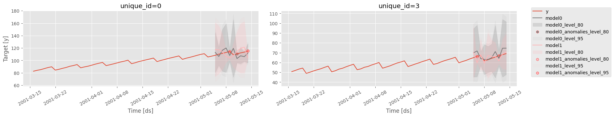

### `plot_series`

```python
plot_series(
    df=None,
    forecasts_df=None,
    ids=None,
    plot_random=True,
    max_ids=8,
    models=None,
    level=None,
    max_insample_length=None,
    plot_anomalies=False,
    engine="matplotlib",
    palette=None,
    id_col="unique_id",
    time_col="ds",
    target_col="y",
    seed=0,
    resampler_kwargs=None,
    ax=None,
)
```

Plot forecasts and insample values.

**Parameters:**

Name | Type | Description | Default
---- | ---- | ----------- | -------
`df` | <code>pandas or polars DataFrame</code> | DataFrame with columns \[`id_col`, `time_col`, `target_col`\]. Defaults to None. | <code>None</code>
`forecasts_df` | <code>pandas or polars DataFrame</code> | DataFrame with columns \[`id_col`, `time_col`\] and models. Defaults to None. | <code>None</code>
`ids` | <code>list of str</code> | Time Series to plot. If None, time series are selected randomly. Defaults to None. | <code>None</code>
`plot_random` | <code>[bool](#bool)</code> | Select time series to plot randomly. Defaults to True. | <code>True</code>
`max_ids` | <code>[int](#int)</code> | Maximum number of ids to plot. Defaults to 8. | <code>8</code>
`models` | <code>list of str</code> | Models to plot. Defaults to None. | <code>None</code>
`level` | <code>list of float</code> | Prediction intervals to plot. Defaults to None. | <code>None</code>
`max_insample_length` | <code>[int](#int)</code> | Maximum number of train/insample observations to be plotted. Defaults to None. | <code>None</code>
`plot_anomalies` | <code>[bool](#bool)</code> | Plot anomalies for each prediction interval. Defaults to False. | <code>False</code>
`engine` | <code>[str](#str)</code> | Library used to plot. 'plotly', 'plotly-resampler' or 'matplotlib'. Defaults to 'matplotlib'. | <code>'matplotlib'</code>
`palette` | <code>[str](#str)</code> | Name of the matplotlib colormap to use for the plots. If None, uses the current style. Defaults to None. | <code>None</code>
`id_col` | <code>[str](#str)</code> | Column that identifies each serie. Defaults to 'unique_id'. | <code>'unique_id'</code>
`time_col` | <code>[str](#str)</code> | Column that identifies each timestep, its values can be timestamps or integers. Defaults to 'ds'. | <code>'ds'</code>
`target_col` | <code>[str](#str)</code> | Column that contains the target. Defaults to 'y'. | <code>'y'</code>
`seed` | <code>[int](#int)</code> | Seed used for the random number generator. Only used if plot_random is True. Defaults to 0. | <code>0</code>
`resampler_kwargs` | <code>[dict](#dict)</code> | Keyword arguments to be passed to plotly-resampler constructor. For further custumization ("show_dash") call the method, store the plotting object and add the extra arguments to its `show_dash` method. Defaults to None. | <code>None</code>
`ax` | <code>matplotlib axes, array of matplotlib axes or plotly Figure</code> | Object where plots will be added. Defaults to None. | <code>None</code>

**Returns:**

Type | Description
---- | -----------
| matplotlib or plotly figure: Plot's figure


```python
from utilsforecast.data import generate_series
```


```python
level = [80, 95]
series = generate_series(4, freq='D', equal_ends=True, with_trend=True, n_models=2, level=level)
test_pd = series.groupby('unique_id', observed=True).tail(10).copy()
train_pd = series.drop(test_pd.index)
```


```python
plt.style.use('ggplot')
fig = plot_series(
    train_pd,
    forecasts_df=test_pd,
    ids=[0, 3],
    plot_random=False,
    level=level,    
    max_insample_length=50,
    engine='matplotlib',
    plot_anomalies=True,
)
fig.savefig('imgs/plotting.png', bbox_inches='tight')
```


